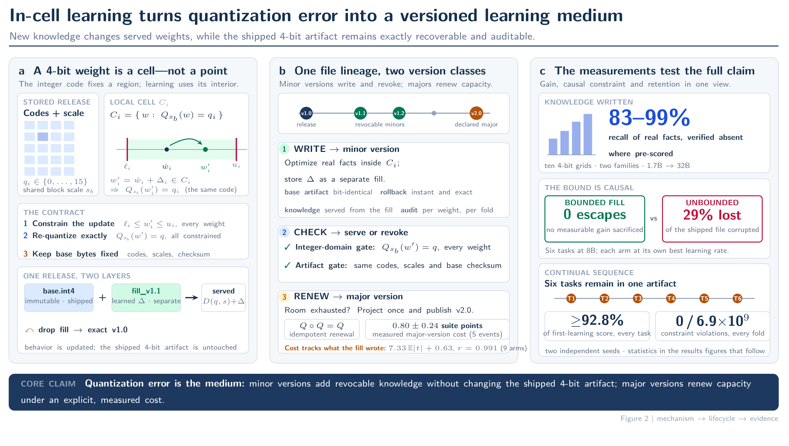

# In-Cell Learning

<p align="center"></p>

<p align="center"></p>

> **Quantization error, long written off as waste, turns out to be pre-paid room: a deployed model can learn inside it, rehearse, and consolidate — acquiring the memory lifecycle that biology builds from complementary learning systems — while the file it shipped as never changes by a single bit.**

Code release for **"In-Cell Learning: Deployed Language Models Can Learn New
Knowledge Without Changing a Single Stored Bit"** (arXiv:2608.20873).

A quantized release defines, for every weight, a cell: the set of values
that round to the same stored code under the artifact's own scales. Serving
`w = anchor + M * tanh(s * z)` keeps every weight strictly inside its cell,
so the model learns while the shipped file's bytes — codes and scales —
remain bit-identical, verifiable by integer-domain re-quantization.

## Eight things this work contributes

1. **A cell, not a point.** The quantized release is reframed from a
   compression artifact into a *fixed reference frame*: every 4-bit weight
   owns a cell of values that all serve the same stored bytes. Learning
   moves weights inside their cells, so the shipped file stays
   bit-identical -- with a formal update contract: bitwise artifact
   invariance, exact revocability, and a drift budget exact to second
   order.
2. **A law of plasticity.** Writing each task into the room the last one
   left decays that room geometrically (measured: beta 0.78-0.85 at 1.7B,
   0.64-0.72 at 8B) -- lifetime capacity without re-quantization is
   finite, the law belongs to the folding operator rather than the grid,
   and it transfers to uniform integer grids. Room partitioned among
   writers, or kept as a revocable increment, is not consumed.
3. **Three training paths that realize the constraint**, including
   CellFill: a bounded reparameterization `w = anchor + M * tanh(s * z)`
   whose invariance holds by construction at every step, so the trained
   and shipped models coincide.
4. **Knowledge capacity in bits.** Synthetic corpora with certain novelty
   and exactly countable information content, declared guessing floors,
   cross-domain forgetting metrics -- and the map of *where* in a network
   new knowledge is cheapest to write.
5. **The learning-forgetting frontier of invariant updates** across
   methods, replay recipes, radii, corpus sizes, scales and
   architectures -- including two load-bearing negative results: a fixed
   rehearsal buffer is memorized and is worse than none, and the
   diagonal-Fisher budget is a scaling law, not a certificate.
6. **A nested refinement code**: updates become prefix-compatible
   (4+k)-bit checkpoints whose 4-bit truncation is always, exactly, the
   original release.
7. **The whole cycle run as a loop at 8B**: six tasks written in sequence
   into one published release, retention >= 94% on every earlier task,
   and the vendor's codes returned on all 6.9 x 10^9 constrained weights
   at every fold; issuing a major version is priced at 0.80 +/- 0.24
   suite points.
8. **The bound is a meter, not a fence.** Measured step metering: raw
   LoRA updates ignore the medium's local scale (at the learning rate
   that diverges 3/3, the median step spans two full cells), while the
   bounded parameterization meters every update in units of each
   weight's own cell half-width -- the structural constraint doubles as
   a per-weight preconditioner.

## Layout

- `cellfill/` — cell geometry per grid family (NF4, uniform W4A16, GGUF):
  walls, half-widths, invariance checks, packed serving, clip-merge, codec.
- `experiments/` — the paper's experiment drivers (single-shot, sequential
  writing with minor/major versions, fusion, capacity, controls).
- `scripts/` — static envelopes, witnesses, figure and table generation.
- `results/` — the archived result files behind every table in the paper:
  exactly the 79 runs `results/MANIFEST.txt` lists, plus the fold-slack
  simulation `results/sim_fold_slack.json` (§ Reproducibility).
- `app/` — the minor-version loop as a single page (`app/app.py`): drop in
  documents, train a bounded fill, read recall / drift / the in-cell check,
  serve, roll back.
- `server/setup.sh` — idempotent Python 3.12 + uv environment that prints the
  resolved library versions and GPU before running the test suite.
- `tests/` — unit tests of the codec (`tests/test_codec.py`): nesting,
  4-bit truncation, exact reconstruction on randomly quantized blocks.

## Quick start

```bash
python experiments/exp_seq.py --model Qwen/Qwen3-1.7B-Base \
  --tasks 1 --facts-per-task 1000 --dense-fill --lr 2e-4 --epochs 8 \
  --out out/quickstart.json
```

Loads the published 4-bit release, trains the paper's champion writer — a
bounded dense fill in which every weight moves only inside its own
quantization cell — and verifies in the integer domain that
re-quantization returns the released codes and scales exactly. (The
paper's recipe uses 24 epochs; 8 is a fast demo. Setup peaks above 24 GB
— a 24 GB card OOMs building the cell walls — with ~17 GB allocated in
steady training, so bring a 32 GB+ GPU or a unified-memory box.)

The champion dense writer and the lighter rank-64 writer share the same
cells and the same integer-domain guarantee — pick by your card:

```bash
python experiments/exp5_qil.py --model Qwen/Qwen3-1.7B-Base --n-facts 1000
```

The rank-64 writer fits a 24 GB card and finishes a reduced run in about
3 minutes.

```bash
python experiments/exp0_clip_rate.py --model Qwen/Qwen3-1.7B-Base --n-facts 1000
```

The clip-merge control (path A), kept for the ablation: trains an
unconstrained adapter first, then clips the merged weights back into the
cells.

## Citation

```bibtex
@article{incell2026,
  title={In-Cell Learning: Deployed Language Models Can Learn New Knowledge
         Without Changing a Single Stored Bit},
  journal={arXiv preprint arXiv:2608.20873},
  year={2026}
}
```

## License

Free for research and educational use; commercial use requires written
authorization — see [LICENSE](LICENSE).
